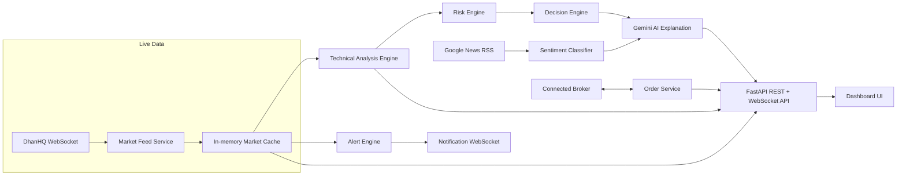

# SmartStock AI

**AI-Powered Stock Advisor, Portfolio Manager & Trading Platform** for the Indian markets (NSE/BSE), built with FastAPI, MySQL, DhanHQ, and Google Gemini.

> ⚠️ **This is a decision-support and educational tool.** It never guarantees profit, a specific return, or a "guaranteed" BUY/SELL. Every analysis, score, and AI-generated explanation in this app is informational only and is not financial advice.

---

## What it does

- **Live market data** for Indian stocks and indices via DhanHQ's WebSocket feed, with automatic reconnection
- **Technical analysis** — SMA/EMA/RSI/MACD, volatility, support/resistance — combined into a transparent, rule-based 0–100 Technical Score (never a black box, never random)
- **Risk engine** — stock-level and portfolio-level risk (LOW/MEDIUM/HIGH), always with plain-English reasons
- **Decision engine** — a fixed decision matrix (technical score × risk) producing FAVORABLE/HOLD/MONITOR/CAUTION/HIGH RISK signals — deterministic, not AI-guessed
- **News & sentiment** — real headlines per stock via Google News RSS, classified with a transparent keyword lexicon
- **AI Assistant** — a Google Gemini-powered chatbot that explains your portfolio, a stock's analysis, or general concepts (e.g. "explain RSI") using only verified data our own engines computed — Gemini never invents prices or decides trades
- **Portfolio management** with live P&L, and a **Watchlist**
- **Smart alerts** (price/profit/loss/RSI/MACD-crossover) with cooldown and deduplication, pushed live over WebSocket, plus a notification center
- **Paper trading** — a full simulated trading account (₹10,00,000 virtual balance) to practice the complete buy/sell workflow risk-free
- **Real broker trading** via a connected Dhan account — order preview → explicit confirmation → broker placement → status tracking, with a `BrokerInterface` abstraction so other brokers can be added later
- **A complete dashboard UI** (12 pages) in plain HTML/CSS/JS + Chart.js — no React, no build step

## Screenshots

_Not included — this is a local/self-hosted app without a public demo deployment. Run it yourself following the steps below to see it live._

---

## Tech stack

| Layer | Technology |
|---|---|
| Backend | Python, FastAPI, Uvicorn |
| Database | MySQL + SQLAlchemy |
| Live market data | DhanHQ WebSocket + REST (official `dhanhq` SDK) |
| AI | Google Gemini (`google-genai` SDK, Interactions API) |
| News | Google News RSS (no API key required) |
| Frontend | HTML, CSS, vanilla JavaScript, Chart.js (vendored, no CDN) |
| Auth | JWT (PyJWT) + bcrypt password hashing |
| Broker secrets | Encrypted at rest with Fernet (`cryptography`) |
| Testing | pytest (114 tests, in-memory SQLite, mocked external APIs) |

## Architecture



Gemini is deliberately downstream of the deterministic engines, never upstream of them — it explains verified data, it doesn't generate it or decide trades on its own.

## Project structure

```
stock/
├── app/
│   ├── main.py            # FastAPI app, middleware, lifespan, router mounting
│   ├── config.py          # Settings loaded from .env
│   ├── database.py        # SQLAlchemy engine/session
│   ├── logging_config.py  # Structured logging setup
│   ├── api/                # Route handlers (one file per feature area)
│   ├── models/              # SQLAlchemy models
│   ├── schemas/             # Pydantic request/response schemas
│   ├── services/            # Business logic
│   ├── analysis/            # Pure-function indicators, scoring, risk, sentiment
│   ├── alerts/               # Alert evaluation engine + scheduler
│   ├── ai/                   # Gemini client wrapper
│   ├── brokers/               # BrokerInterface + DhanBroker implementation
│   ├── websocket/             # Connection managers (market + per-user notifications)
│   └── utils/                  # Security (JWT/bcrypt), encryption, market hours
├── frontend/
│   ├── templates/          # Jinja2-rendered pages
│   └── static/               # CSS, JS, vendored Chart.js
├── tests/                   # pytest suite (155 tests)
├── migrations/               # Alembic migrations (schema version history)
├── create_tables.py         # One-off: create all DB tables (fresh DB only — see Database migrations)
├── seed_stocks.py           # One-off: seed starter stocks + indices
├── Dockerfile / docker-compose.yml
├── requirements.txt
├── .env.example
└── pytest.ini
```

---

## Getting started (local, without Docker)

### Prerequisites
- Python 3.11+
- MySQL 8.0+ running locally
- (Optional, for full functionality) a [Dhan](https://dhan.co) trading account and a [Google Gemini API key](https://aistudio.google.com/apikey)

### 1. Clone and set up a virtual environment

```bash
git clone <your-repo-url>
cd stock
python -m venv venv
```

Windows PowerShell:
```powershell
.\venv\Scripts\Activate.ps1
pip install -r requirements.txt
```

### 2. Create the database

```sql
CREATE DATABASE IF NOT EXISTS smartstock_ai CHARACTER SET utf8mb4 COLLATE utf8mb4_unicode_ci;
CREATE USER IF NOT EXISTS 'smartstock_app'@'localhost' IDENTIFIED BY 'CHOOSE_A_STRONG_PASSWORD';
GRANT ALL PRIVILEGES ON smartstock_ai.* TO 'smartstock_app'@'localhost';
FLUSH PRIVILEGES;
```

### 3. Configure environment variables

```bash
cp .env.example .env
```

Fill in `.env` — see the [Environment variables](#environment-variables) table below for what each one does and where to get it. `SECRET_KEY` and `BROKER_ENCRYPTION_KEY` can be generated locally (commands are in the file's comments).

### 4. Create tables and seed starter data

For a brand-new database:

```powershell
python create_tables.py
alembic stamp head
python seed_stocks.py
```

`alembic stamp head` tells Alembic this fresh database is already at the latest schema, without re-running any migration DDL. Going forward, schema changes should go through Alembic instead of hand-editing `create_tables.py` — see [Database migrations](#database-migrations) below.

### 5. Run

```powershell
uvicorn app.main:app --reload
```

Open `http://127.0.0.1:8000` — you'll land on the login page.

---

## Environment variables

| Variable | Required | Where to get it |
|---|---|---|
| `DB_HOST`, `DB_PORT`, `DB_USER`, `DB_PASSWORD`, `DB_NAME` | Yes | Your own MySQL setup (see step 2 above) |
| `SECRET_KEY` | Yes | Generate: `python -c "import secrets; print(secrets.token_hex(32))"` |
| `BROKER_ENCRYPTION_KEY` | Yes | Generate: `python -c "from cryptography.fernet import Fernet; print(Fernet.generate_key().decode())"` |
| `ALGORITHM`, `ACCESS_TOKEN_EXPIRE_MINUTES` | No (defaults provided) | JWT config |
| `GEMINI_API_KEY` | Only for AI features | [aistudio.google.com/apikey](https://aistudio.google.com/apikey) |
| `GEMINI_MODEL` | No (defaults to `gemini-3.5-flash-lite`) | Change if you want a different Gemini model |
| `DHAN_CLIENT_ID`, `DHAN_ACCESS_TOKEN` | Only for live market data | [web.dhan.co](https://web.dhan.co) → profile → Access DhanHQ APIs |
| `APP_BASE_URL` | Yes, for broker connect | Your app's own public URL (e.g. `http://127.0.0.1:8000` locally) |

**Without `DHAN_CLIENT_ID`/`DHAN_ACCESS_TOKEN` or `GEMINI_API_KEY`**, the app still runs — market data and AI features return an honest `503 unavailable` instead of fabricated data, everywhere. This was a deliberate design principle throughout the project: never invent a price, score, or news item.

---

## Database migrations

Schema changes are managed with [Alembic](https://alembic.sqlalchemy.org/) (`migrations/`), not by hand-editing `create_tables.py` or dropping/recreating tables.

After changing a model in `app/models/`:

```powershell
alembic revision --autogenerate -m "describe the change"
alembic upgrade head
```

Always read the autogenerated migration before applying it — autogenerate can miss things (e.g. it won't infer a data backfill), and on MySQL specifically its `downgrade()` sometimes emits a standalone `drop_index()` for an index that backs a foreign key, which MySQL/InnoDB refuses to drop separately from the table itself; if `alembic downgrade` fails with "needed in a foreign key constraint," remove the redundant `drop_index()` calls and just drop the table (this happened in the very first migration in this repo — see `migrations/versions/aa16fe1a1e46_initial_schema.py`'s `downgrade()` for a worked example).

Other useful commands: `alembic current` (what revision is this DB at), `alembic history` (list all migrations), `alembic downgrade -1` (revert the last one).

---

## Running the tests

```powershell
pytest
```

155 tests covering auth (including rate limiting and change-password), technical indicators (cross-checked against pandas), the risk/decision engines, portfolio P&L, paper trading, the alert engine (including cooldown and crossover-detection edge cases), order placement/cancellation/modification/preview, broker holdings/funds sync, WebSocket auth, and broad API endpoint coverage. Tests run against an isolated in-memory SQLite database and mock all external APIs (Dhan, Gemini) — they never touch your real database or spend real API quota.

## API documentation

Interactive Swagger docs are auto-generated at `/docs` once the server is running. Broad categories:

- **Auth** — `/auth/register`, `/auth/login`, `/auth/me`, `/auth/logout`
- **Stocks** — search, quote, technical analysis, news, AI explanation
- **Portfolio / Watchlist** — CRUD + live P&L
- **Alerts / Notifications** — CRUD + `/ws/notifications` live push
- **Chat** — `/chat`, session history
- **Paper Trading** — `/paper/account`, `/paper/orders/buy|sell`
- **Broker / Orders / Trades** — connect flow, real order placement, history
- **Market** — `/ws/market` live tick stream, `/market/status`

---

## Deployment

### Docker (recommended for a quick, reproducible run)

```bash
docker compose up --build
```

This starts MySQL and the app together. On first run, create the tables and seed data inside the running container:

```bash
docker compose exec app python create_tables.py
docker compose exec app alembic stamp head
docker compose exec app python seed_stocks.py
```

> **Note:** I don't have Docker available in the environment I built this in, so I couldn't run `docker compose up` end-to-end myself. What I *did* verify: installed `requirements.txt` into a completely fresh virtual environment (not the incrementally-built one used throughout this project) and confirmed the app imports cleanly — the same two steps the Dockerfile's build performs. The container networking/MySQL wiring itself is untested; please try it and let me know if anything needs adjusting.

### A note on scaling

The app intentionally runs as a **single worker process**. `market_cache`, the alert/order background schedulers, and the live WebSocket connection managers all live in that one process's memory — running multiple Uvicorn workers (`--workers N`) would fragment this state (each worker would have its own disconnected cache and could double-fire alerts). If you need to scale beyond one process, that state would need to move to a shared store (e.g. Redis) first — not implemented here, since a single well-resourced process is sufficient for this project's scope.

### Deploying to a real host

This app deploys like any FastAPI + MySQL service: any host that can run a long-lived Docker container or a Python process behind a reverse proxy (for TLS) works. Specific platform instructions (Railway, Render, a VPS, etc.) aren't included here since I haven't verified current platform-specific steps against this exact app — check the platform's own current documentation before deploying, and never commit real `.env` values.

---

## Security notes

- Passwords are bcrypt-hashed, never stored in plain text
- JWTs are used for API auth; broker `app_secret`/access tokens are encrypted at rest (Fernet) with a key separate from the JWT signing key
- Every by-ID database lookup is scoped to the requesting user (audited in Phase 18; one deliberate exception — the broker OAuth callback — is documented in code)
- Structured request logging never logs headers, bodies, passwords, or tokens
- Frontend content from external sources (news headlines) is HTML-escaped before rendering — fixed after a real stored-XSS finding during the Phase 18 security review
- `.env` is git-ignored; `.env.example` has placeholders only

## Known limitations

- No exchange holiday calendar — the market-hours check knows weekday/weekend and trading hours, not specific holidays
- No real Dhan Partner OAuth (that requires Dhan's business approval); the broker connect flow uses Dhan's "individual API key" flow instead, which requires each user to generate their own `app_id`/`app_secret`
- Fundamental analysis (P/E, ROE, revenue growth, etc.) isn't implemented — no verified data source for it was integrated
- Settings page is read-only — no backend endpoints exist yet for profile/password changes

## Disclaimer

SmartStock AI is a personal/portfolio project for educational purposes. It is **not** a registered investment advisor, and nothing it outputs is financial advice. All trading involves risk of loss. If real broker trading is enabled, every order requires your own explicit confirmation — the app and its AI assistant never place a trade on your behalf.

## Acknowledgments

- [DhanHQ](https://dhanhq.co) for market data and trading APIs
- [Google Gemini](https://ai.google.dev) for AI explanations
- Google News for news headlines
